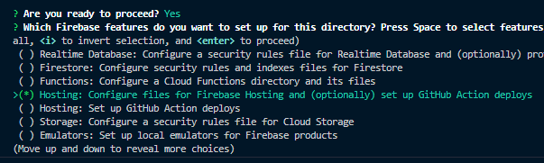
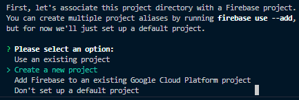
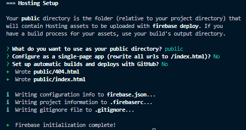

# How to host your first site for free with Google Firebase

**A step by step tutorial**

1. To begin, we're going to go ahead and fire up our IDE of choice, in my case VS Code, and open a new folder.   

2. Once we are in our new folder in VS Code, we're going to open up our terminal and run the following command in order to install firebase tools globally  
`npm install -g firebase-tools`   
3. Once this is installed we can get our hosting setup with the following set of commands  
`firebase login`  
This will prompt us to sign in with the Google account that we created the project with   
`firebase init`  
After running this command we will want to go down and select the hosting option to configure foles for Firebase Hosting, as seen below   
   
We will then be prompted to either use an existing project or create a new one, and we're going to go ahead and create one.
   
Give your new project an ID and name, and specify the public directory (can just leave as public by pressing enter) we will just have a few more questions to answer.   
   
For now answer no to single-page app and automatic builds with Github, and we will be done initializing our new project.   
4. All that's left to do at this point in the process is to deploy our new site!
 Use the following command  
`firebase deploy`  
and our new site should be live!   
 
You can view an example of a completed setup at the following domain https://examplefirebase8888.web.app/